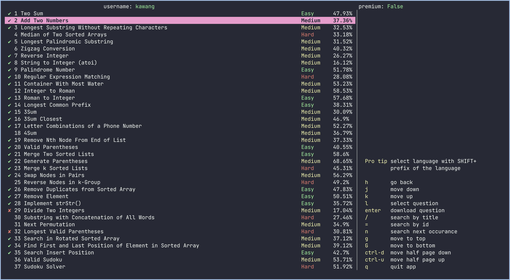
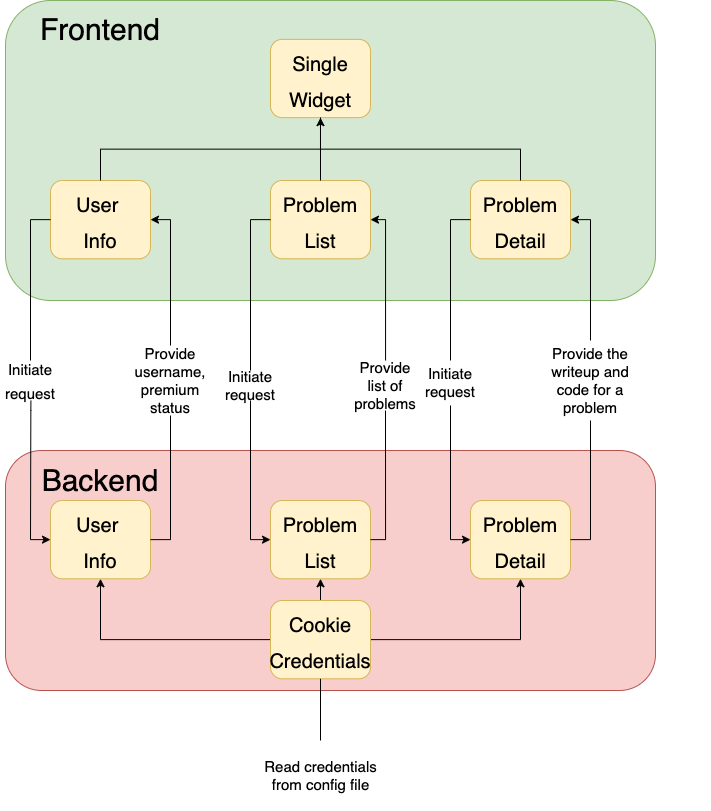

# AlgoMonad

## Author

Karl Wang

## Introduction

AlgoMoond is a haskell TUI that allows user to download LeetCode questions through the TUI to their local machines, edit them in their favorite editors, and submit them through the TUI.

The motivation to create this program is that LeetCode only allows the user to edit and submit the code on their website. However, programmers tend to want to edit code in their favorite editors instead of in the browser. Hence, I would like to create a interface that allows the user to download to local machine and submit from local machine.

## Installation

Clone the repository and run `stack install` to install the TUI. To run the test cases, run `stack test`

## Guide

### Login Credentials

AlgoMonad needs to use the cookie credentials from leetcode in order to acquire user leetcode information. If you are on MacOS, you can either acquire the credentials manually or automatically. If you are on other platforms, currently you can only acquire the credentials manually.

#### Manual

If not already login, login to leetcode account on [leetcode.com](https://leetcode.com/) on a Chromium browser.

After that, go to [chrome://settings/cookies/detail?site=leetcode.com](chrome://settings/cookies/detail?site=leetcode.com) to copy the value of **LEETCODE_SESSION** and **csrftoken** under _Content_

Then create the file `~/.algomonad.yaml` and write the file as followed:

```yaml
LEETCODE_SESSION: YOUR_LEETCODE_SESSION_VALUE
csrftoken: YOUR_CSRFTOKEN_VALUE
```

#### Automatic

Currently, the automatic cookie extraction only works on MacOS with **Chrome** browser.

If not already login, login to leetcode account on [leetcode.com](https://leetcode.com/) on Google Chrome browser.

Then run `algomonad login` on the shell. This should create a file at `~/.algomonad.yaml` with two keys, **LEETCODE_SESSION** and **csrftoken**.

If your Chrome profile path is not the default profile path, you can go to [chrome://version](chrome://version), and copy the profile path under **Profile Path**.
After that, you can acquire the credentials with `algomonad login "PROFILE_PATH"`. An example of using the command should look like
`algomonad login "/Users/username/Library/Application Support/Google/Chrome/Profile 1"`.

#### Example

An example of the config under `~/.algomonad.yaml` file should look like the following:

```yaml
LEETCODE_SESSION: eyJ0eXAiOiJKV1QiLCJhbGciOiJIUzI1NiJ9.eyJfYXV0aF91c2VyX2lkIjoiMjAzNDM3MCIsIl9hdXRoX3VzZXJfYmFja2VuZCI6ImFsbGF1dGguYWNjb3VudC5hdXRoX2JhY2tlbmRzLkF1dGhlbnRpY2F0aW9uQmFja2VuZCaaksi9hdXRoX3VzqXJfaGFzaCI6IjM3ZDgxYzI0NTFkZWIxOTAzZDk2ZTMzMTY1YzIwMzgwMTc3YTYxMDciLCJpZCI6MjAzNDM3MCwiZW1haWwiOiJrYXdhbmdAdWNzZC5lZHUiLCJ1c2VybmFtZSI6Imthd2FuZyIsInVzZXJfc2x1ZyI6Imthd2FuZyIsImF2YXRhciI6Imh0dHBzOi8vYXNzZXRzLmxlZXRjb2RlLmNvbS91c2Vycy9rYXdhbmcvYXZhdGFyXzE1NjEyMjg5ODMucG5nIiwiqiwkmVzaGVkX2F0IjoxNjM5MDE0NDkxLCJpcCI6Ijc1LjgwLjEwOC4xNzIiLCJpZGVudGl0eSI6IjAzMjE0NWI4NDc3ZDZiM2ZiMzRlMGU1OTU0YjU5YjI0Iiwic2Vzc2lvbl9pZCI6MTU0ODI2NjZ9.K-jh_WU-KOknhPRYyh4OiRs8vqGnRc1JU8tmILGoHiM
csrftoken: W43GFtqFER8nADnf9apPmfUTYqrkPRz1XN6V712GAJWuE1RxUThv9QlQyGlb5Prh
```

### Usage

With the credentials acquired, now run `algomonad` on the shell. You should be greeted with the following interface



AlgoMonad uses vim keybindings. This means that use _k/j_ to move up and down. _l_ to select question. _h_ to go back to the problem list.
_Ctrl-d_ to move half page down and _Ctrl-u_ to move half page up.

If a language is selected, use _enter_ to download the question. The question will be downloaded to the current directory.

When in problem list, use _/_ to do a case insensitive search by title, with _n_ to search the next occurrence. Use _=_ to search by problem id.

Use _q_ to quit.

## Architecture

The architecture is split into two parts, frontend and backend. The frontend mainly deals with Brick library to handle user events and updating the states. The backend is responsible for network requests to get problems and user information.

Some of the key components are the following:

- **UserInfo**: get the username and whether the user has leetcode premium.
- **Problem**: get the list of problems and their statistics.
- **ProblemDetail**: get the code and write up of the problem.



## Challenges

The biggest challenge I have is to acquire the cookies from Browser. The location of the cookies are not only browser and platform dependent, but also the decryption of the cookies differs depending on the platforms.

## Libraries

Here is a list of essential libraries needed for this program

- [req](https://hackage.haskell.org/package/req): to make request
- [brick](https://hackage.haskell.org/package/brick): to make TUI
- [cryptonite](https://hackage.haskell.org/package/cryptonite): to decrypt the Chrome cookies
- [sqlite-simple](https://hackage.haskell.org/package/sqlite-simple): to connect the sqlite cookie database
- [yaml](https://hackage.haskell.org/package/yaml): to extract the key value pair from yaml file
- [aeson](https://hackage.haskell.org/package/yaml): to handle JSON object from the response

## Goals

- [x] Acquire user token automatically through browser cookies.
- [x] Browse LeetCode questions.
- [x] Download and write LeetCode questions to local files.
- [x] Submit local files to LeetCode and evaluate result.

## Inspirations

- [leetcode-cli](https://github.com/skygragon/leetcode-cli): Main source of inspiration. However, this is just a pure cli instead of a TUI. Implemented in javascript.
- [vscode-leetcode](https://github.com/LeetCode-OpenSource/vscode-leetcode): A GUI for LeetCode. However, only available on VSCode. Implemented in javascript.
